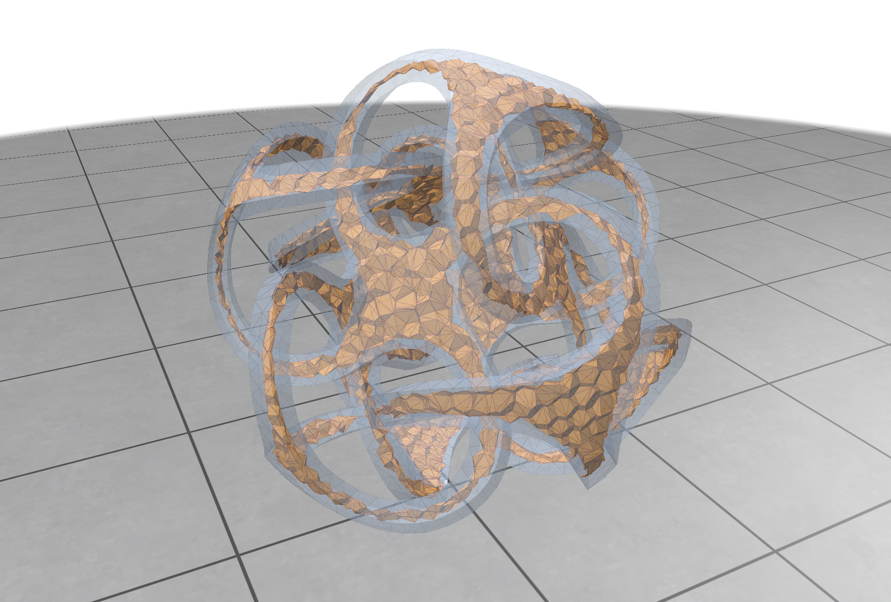

# medial-axis-3D

`medial-axis-3D` is an experimental C++17 tool for extracting and exploring
an approximate medial-axis sheet complex inside a closed triangle mesh.

I would like to give credit to Prof. Jonathon Shewchuk for his predicates from Triangle which I used in this approach.



The pipeline:

1. reads a TetGen `.node` point set and an optional companion `.face` surface;
2. validates and consistently orients the closed surface;
3. creates deterministic surface samples;
4. builds a 3D Delaunay tetrahedralization and its interior Voronoi dual;
5. validates inward Voronoi poles and medial balls;
6. constructs pole-supported medial sheets;
7. filters them using local feature size, radius continuity, and component
   support, while recording 40/80/160-sample cross-resolution stability as a
   diagnostic; and
8. displays the result interactively with Polyscope.

This is a practical geometric approximation, not an exact symbolic medial-axis
solver. A 3D medial axis is a stratified collection of sheets and curves, so
sheet terminations, seams, and junctions are expected. Isolated punctures
inside an otherwise coherent sheet are not expected and are treated as
topology defects.

## How the algorithm works

The medial axis of a solid is the set of centers of maximal balls contained in
the solid. In a sampled 3D model, those centers are approximated by vertices of
the Voronoi diagram of the surface samples. The implementation turns that idea
into a sheet complex as follows:

1. **Validate and sample the surface.** The companion `.face` mesh is checked
   for a closed, consistently oriented, two-manifold surface. Original mesh
   vertices are always preserved, and optional deterministic uniform or
   adaptive samples are added on its triangles.
2. **Build the Delaunay/Voronoi structure.** A 3D Delaunay tetrahedralization
   of the surface samples is constructed with adaptive exact orientation and
   in-sphere predicates. Each tetrahedron circumcenter is a Voronoi vertex.
   Circumcenters outside the input solid are discarded using the oriented-mesh
   winding number.
3. **Construct candidate Voronoi polygons.** Every eligible Delaunay edge has
   a dual Voronoi polygon formed by its incident tetrahedron circumcenters.
   Only polygons with at least three interior vertices are candidates. Polygon
   boundary edges and fan diagonals are also tested against the surface so a
   chord between two interior vertices cannot leave and re-enter a concave
   solid unnoticed.
4. **Find inward poles and medial balls.** For each surface sample, the
   algorithm selects an inward Voronoi pole and checks its radius, surface
   contacts, and normal/contact evidence. Validated poles seed nearby candidate
   polygons; support is propagated for a small, resolution-scaled number of
   shared-Voronoi-edge rings.
5. **Select complete sheet strata.** A candidate polygon is initially selected
   when it has pole support or strong contact-angle evidence and passes the
   weak continuation angle. The decision is made for the entire Voronoi
   polygon, not for individual fan triangles. Rejected polygons enclosed by a
   retained sheet can be restored, and a seeded two-dimensional stratum is
   completed across ordinary incidence-two edges. Completion stops at
   incidence-three-or-greater seams so it does not flood between sheets at a
   medial junction.
6. **Measure rather than aggressively delete.** Local feature size, sampling
   density, medial radius, radius continuity, confidence, component support,
   and optional cross-resolution stability are attached as diagnostic weights.
   With the default options these stages do not delete otherwise supported
   geometry, because per-triangle pruning easily punches holes into a sheet.
7. **Classify the resulting topology.** Incidence-one edges are grouped into
   boundary loops and classified as supported sheet terminations, boundaries
   touching seams or junctions, or unresolved artificial boundaries.
   Incidence-three-or-greater edges are reported as medial seams, with their
   endpoints and branches reported as junctions.

The important distinction is that topology repair operates only on Voronoi
polygons already present in the candidate complex. It can close a rejected
patch surrounded by retained polygons, but it cannot invent a dual cell that
candidate construction never produced.

### Why complex models can still contain holes

The current implementation starts from an **unconstrained** Delaunay
tetrahedralization of surface samples and then keeps/tests its interior
Voronoi dual. It does not yet build a constrained tetrahedralization of the
solid or geometrically clip every dual polygon against the input boundary. In
a simple or nearly convex model, a dual polygon is often wholly inside or
wholly outside, so this approximation can look clean. In a strongly concave,
high-genus model such as Fertility, a dual polygon can straddle the surface. If
fewer than three of its circumcenters remain inside, or if its reconstructed
fan crosses the surface, the complete polygon is omitted. The resulting gap
reaches the boundary of the available candidate complex and cannot be safely
filled by the bounded repair pass.

Resampling has an additional current limitation. Once added samples make the
Delaunay point set differ from the original surface vertex list, the code does
not retain a complete triangulated-surface edge map for the new samples and
falls back to Delaunay convex-hull edges when excluding boundary-edge duals.
Consequently, changing the sample count can change the candidate definition as
well as its resolution. A denser result may close a particular gap while also
introducing extra near-surface or fragmented candidates; it is not proof of
topological convergence.

These limitations explain why the simple example may have no unresolved holes
while Fertility still has a few. The robust predicates protect Delaunay
orientation and in-sphere decisions, and the polygon-level rules prevent the
filters from creating arbitrary fan-triangle punctures, but those safeguards
cannot guarantee completeness of the initial medial candidate complex. A
stronger solution requires preserving surface connectivity during resampling
and using a constrained interior tetrahedralization, a properly clipped
restricted Voronoi construction, or a medial-sphere/power-diagram method.

## Requirements

- CMake 3.16 or newer
- A C++17 compiler
- Git and internet access during the first CMake configure
- A graphics driver supporting OpenGL 3.3 for the interactive viewer

Polyscope is found as an installed CMake package when available. Otherwise,
CMake downloads and builds it automatically.

## Build

### Windows

Run from PowerShell or a Visual Studio Developer Command Prompt:

```powershell
cmake -S . -B build
cmake --build build --config Release
```

Executables are written to `build\Release\` with the Visual Studio generator.

Close a running `polyscope_viewer.exe` before rebuilding it. Windows locks the
executable while the viewer is open, and MSBuild will otherwise fail with
`LNK1168: cannot open ... polyscope_viewer.exe for writing`.

### Linux or macOS

```bash
cmake -S . -B build -DCMAKE_BUILD_TYPE=Release
cmake --build build --parallel
```

Executables are normally written directly to `build/` with a single-config
generator.

## Quick start

Open the included concave example on Windows:

```powershell
.\build\Release\polyscope_viewer.exe `
  .\examples\dented_cube.node `
  .\build\dented_cube_160.ele `
  --samples 160
```

On Linux or macOS:

```bash
./build/polyscope_viewer \
  ./examples/dented_cube.node \
  ./build/dented_cube_160.ele \
  --samples 160
```

`--samples N` is a minimum, not necessarily the exact displayed sample count.
The displayed run preserves every original mesh vertex, so a 4,494-vertex mesh
still uses at least 4,494 samples when invoked with `--samples 160`. With a
valid companion `.face` file, separate exact 40, 80, and 160-sample runs
estimate cross-resolution stability. Those coarse runs provide diagnostic
weights and do not delete geometry by default.

For a faster non-interactive run:

```powershell
.\build\Release\polyscope_viewer.exe `
  .\examples\dented_cube.node `
  --samples 160 `
  --no-cross-resolution `
  --no-gui
```

`--no-cross-resolution` is recommended while iterating on geometry. Stability
is diagnostic-only by default, so disabling its extra runs reduces execution
time without changing which base-resolution triangles are retained.

To redistribute a fixed sample budget toward locally undersampled regions,
enable the deterministic two-pass adaptive sampler:

```powershell
.\build\Release\polyscope_viewer.exe `
  .\data\fertility.node `
  --samples 6000 `
  --adaptive-sampling `
  --no-cross-resolution
```

The pilot pass uses the original surface vertices to estimate local resolution
`h` and local feature size `LFS`. Added samples are then weighted toward
triangles with high `h/LFS`, while preserving the requested total sample count
and every original mesh vertex. The pilot adds runtime, so compare adaptive and
uniform runs at the same final sample count.

Sampling-convergence experiments can be automated in headless mode:

```powershell
python .\tools\sampling_convergence.py `
  .\data\fertility.node `
  --samples 4494 6000 9000
```

Add `--adaptive-sampling` to benchmark adaptive allocation. The script writes
a CSV summary and individual run logs under `build/`.

To print a stage-by-stage timing breakdown directly in the VS Code terminal,
add `--profile-stages` to a headless run:

```powershell
.\build\RelWithDebInfo\polyscope_viewer.exe `
  .\data\fertility.node `
  --samples 6000 `
  --adaptive-sampling `
  --no-cross-resolution `
  --no-gui `
  --profile-stages |
  Tee-Object .\build\fertility_profile.log
```

Timing records use the machine-readable form
`PROFILE stage=<name> seconds=<value>`. Show only those records with:

```powershell
Select-String `
  -Path .\build\fertility_profile.log `
  -Pattern '^PROFILE'
```

The `validated_medial_complex` record is followed by nested records for
candidate generation, point containment/winding, surface-distance queries,
segment intersections, pole-support propagation, and topology completion.
These nested records partition that parent stage and should not be added to it
again when computing total runtime.

For the current fertility model, the recommended interactive iteration command
is:

```powershell
.\build\Release\polyscope_viewer.exe `
  .\data\fertility.node `
  --samples 160 `
  --no-cross-resolution
```

Omit `--no-cross-resolution` when you want the additional stability quantities
for inspection. The retained base geometry is the same in either mode.

To save a rendering and exit:

```powershell
.\build\Release\polyscope_viewer.exe `
  .\examples\dented_cube.node `
  --samples 160 `
  --screenshot .\build\dented_cube.png
```

## Input format

The required `.node` file uses the
[TetGen node format](https://www.wias-berlin.de/software/tetgen/fformats.node.html):

```text
<# points> 3 <# attributes> <0 or 1 boundary markers>
<point id> <x> <y> <z> [attributes] [boundary marker]
```

For a non-convex object, provide a triangle surface with the same base name and
a `.face` extension:

```text
<# faces> <0 or 1 boundary markers>
<face id> <node id> <node id> <node id> [boundary marker]
```

For example:

```text
model.node
model.face
```

The surface must be:

- closed and watertight;
- triangular;
- free of non-manifold edges;
- indexed using node IDs from the companion `.node` file.

Face orientation does not need to be consistent on input; the loader repairs
consistent orientation and orients closed components outward.

Without a companion `.face`, the program uses the convex Delaunay boundary.
Surface resampling and cross-resolution analysis require a valid `.face` file.

## Using downloaded 3D models

Most public datasets provide OBJ, OFF, PLY, or STL files. ASCII OFF files can
be converted directly with the included dependency-free Python utility:

```powershell
python .\tools\off_to_tetgen.py .\data\model.off
```

This writes `model.node` and `model.face`. Run the viewer using the generated
node file:

```powershell
.\build\Release\polyscope_viewer.exe `
  .\data\model.node `
  .\build\model_medial.ele `
  --samples 160
```

Alternatively, convert supported surface formats with
[TetGen](https://www.wias-berlin.de/software/tetgen/):

```powershell
tetgen -p .\data\model.off
```

TetGen normally produces:

```text
model.1.node
model.1.face
model.1.ele
```

Use the generated `.node`; the viewer automatically finds the matching `.face`:

```powershell
.\build\Release\polyscope_viewer.exe `
  .\data\model.1.node `
  .\build\model_medial.ele `
  --samples 160
```

Good sources for test meshes include:

- [Princeton Mesh Segmentation Benchmark](https://segeval.cs.princeton.edu/)
  for a downloadable collection of watertight OFF meshes;
- [Stanford 3D Scanning Repository](https://graphics.stanford.edu/data/3Dscanrep/)
  for scanned physical objects;
- [Thingi10K](https://github.com/Thingi10K/Thingi10K) for a wide range of
  3D-printing meshes; and
- [ABC Dataset](https://deep-geometry.github.io/abc-dataset/) for CAD parts.

Repair holes and non-manifold edges before conversion. Large scanned models
should be decimated to a few thousand or tens of thousands of faces because
the current exact surface queries prioritize clarity over large-mesh
performance.

## Command-line options

```text
polyscope_viewer <input.node> [output.ele] [options]
```

| Option | Meaning |
| --- | --- |
| `--samples N` | Generate at least `N` deterministic area-weighted surface samples. Original mesh vertices are always preserved. |
| `--adaptive-sampling` | Use an original-vertex `h/LFS` pilot to redistribute added samples within the fixed `--samples` budget. |
| `--profile-stages` | Print machine-readable elapsed time for each major pipeline stage and the total run. |
| `--no-gui` | Run the complete pipeline, print statistics, and exit. |
| `--screenshot FILE` | Render one image to `FILE` and exit. |
| `--no-cross-resolution` | Disable the additional 40/80/160 stability runs. |
| `--min-contact-angle X` | Set the weak sheet-continuation angle from `0` to `180` degrees. The default is `35`; the independent strong-mediality seed remains `90` degrees. |
| `--support-rings N` | Override pole-support propagation rings. `0` uses automatic resolution scaling. |
| `--max-relative-radius-jump X` | Set the maximum allowed relative medial-radius jump. |
| `--fixed-radius-jump` | Use one global radius-jump threshold instead of adaptive LFS thresholds. |
| `--min-component-triangles N` | Set the minimum component triangle count. |
| `--min-component-area-fraction X` | Set the minimum component area fraction from `0` to `1`. |
| `--min-component-confidence X` | Set the minimum mean confidence from `0` to `1`. |
| `--min-component-poles N` | Require at least `N` directly supporting validated poles. The default is `0` because propagated pole support can validate a neighboring sheet. |

To make the radius-discontinuity weight maximally permissive:

```text
--fixed-radius-jump --max-relative-radius-jump 1
```

When `output.ele` is supplied, it contains the generated Delaunay tetrahedra,
not the medial-sheet triangles. When resampling is enabled, a matching
`output.node` is written beside it.

## Polyscope controls and layers

The main orange result is `pole-supported medial sheets`. It contains the
retained 2D strata. A 3D medial axis is not generally one closed manifold:
multiple sheets can meet along singular curves, and nearly circular tubular
parts can collapse toward narrow ribbons or 1D center curves. The disabled
`medial axis approximation` layer displays the interior Voronoi graph and is
useful when inspecting those curve-like regions; it is a diagnostic candidate
graph rather than a fully filtered final axis.

Useful quantities and diagnostic structures include:

- `sheet confidence`
- `contact angle`
- `medial radius`
- `relative radius jump`
- `surface resolution`
- `estimated LFS`
- `sampling density h/LFS`
- `cross-resolution stability`
- `pole support weight`
- `medial sheet boundaries`
- `validated sheet terminations`
- `unresolved artificial sheet boundaries`
- `medial sheet seams`
- `medial sheet junctions`
- `restored rejected Voronoi faces`
- `radius-discontinuity weights`
- `removed unstable sheet components`
- `removed resolution-unstable sheets` (only populated when destructive
  stability pruning is explicitly enabled through the library API)
- `validated medial balls`
- `contact points` and `contact spokes`
- `rejected sheet candidates`

Most diagnostic layers start disabled. Enable them in Polyscope's structure
list when investigating a result.

The adaptive radius threshold uses local sampling density `d = h / LFS`:

```text
threshold = clamp(0.35 + 0.60 * d / (1 + d), 0.35, 0.85)
```

Cross-resolution stability matches medial vertices by LFS-normalized position
and radius, then matches sheet components using overlap, orientation, pole
support, and topology. The 40, 80, and 160 comparison runs use exact downsample
counts, while the displayed run may contain thousands of preserved original
vertices. Because that resolution mismatch can be very large, stability is a
diagnostic weight by default. Library callers may explicitly opt into
destructive component pruning.

Pole support, confidence, and radius continuity are weights rather than
per-triangle deletion tests. Propagated pole support is sufficient by default;
requiring every sheet stratum to contain a pole's exact source tetrahedron
incorrectly removes valid neighboring faces.

Contact angle uses hysteresis-like weak and strong roles. A `90`-degree angle
is strong medial evidence, but it is not used as a hard deletion threshold:
doing so reduced Fertility to 4,307 polygons, split it into 1,689 strata, and
cut valid tapering regions out of its sheets. Supported sheet continuation is
accepted down to the weak `35`-degree default. Rejected regions are then
flooded as complete Voronoi polygons. First, enclosed rejected patches are
restored. Then every 2D stratum containing retained medial evidence is
completed across ordinary incidence-two polygon edges. Completion stops at
incidence-three-or-greater medial seams, so it cannot leak from one sheet into
another at a junction.

For Fertility, the completed-strata result is the current visual reference
because it most closely matches the sheet layout shown in MATTopo. Two
follow-up experiments were deliberately rejected:

- admitting every surface-clipped face from the unrestricted Voronoi diagram
  filled more space but added many near-surface radial sheets; and
- clipping those faces by a local contact-angle disk made the result denser
  and visually less medial.

Those experiments showed that filling every missing geometric candidate is
not equivalent to recovering the medial axis. The next candidate-construction
change should use a MATTopo-style medial-sphere/power-diagram or constrained
interior selection criterion, rather than merging the full restricted Voronoi
complex into the completed strata.

A Voronoi polygon is treated as one atomic 2-cell. Its arbitrary fan triangles
receive the same keep/remove decision, preventing a filter from carving
triangulation-shaped holes through half of a dual face. Polygon-level topology
repair likewise restores the entire rejected 2-cell patch, never a selection
of its fan triangles. Boundary loops are classified as real terminations,
seams/junctions, or unresolved artificial boundaries.

## Containment and interpretation

Every retained medial vertex must be inside the closed input surface. In a
non-convex solid, however, two interior Voronoi vertices can have a straight
connecting chord that exits and re-enters the object. The implementation
therefore:

- classifies each candidate circumcenter with the oriented-mesh winding
  number;
- tests retained Voronoi edges against the surface triangles;
- checks polygon boundary edges and fan diagonals for surface crossings; and
- rejects a complete polygon rather than leaving a partial triangulation.

The startup summary reports both contained and rejected graph edges:

```text
... 26338 contained Voronoi edges
    (rejected 0 exterior-crossing edges), ...
```

On the included `data/fertility` model, the current deterministic
base-resolution reference run retains 30,146 triangles from 11,602 complete
Voronoi polygons with the default weak `35`-degree continuation threshold.
This includes 2,260 triangles restored across 230 completed polygon strata;
component confidence and boundary validity are diagnostic by default and
remove zero additional triangles. The 40/80/160 stability runs report scores
in `[0.25, 1]` and remove zero
triangles by default. Counts can change when options or input data change.

The implementation still starts from an unconstrained Delaunay
tetrahedralization and clips/tests its dual against the surface. It is a
practical approximation, not the same thing as the dual of a constrained
interior tetrahedralization. Highly pathological, self-intersecting, or nested
surfaces require stronger input repair or a constrained tetrahedralization.

## Troubleshooting

- **The result is unexpectedly sparse:** ensure you rebuilt and restarted the
  viewer. Older builds destructively pruned the detailed 4,494-sample result
  against the fixed 40/80/160 stability runs or applied `90` degrees as a
  per-polygon cutoff. The current default records stability without deleting
  base geometry and uses `90` degrees only as strong evidence. Temporarily
  lower `--min-contact-angle` to determine whether a region is absent because
  of sheet selection or because no usable Voronoi polygon was constructed.
- **The result appears to cross the transparent surface:** inspect the
  `rejected ... exterior-crossing edges` count and rotate the view before
  concluding that a chord is outside; transparency can make depth ambiguous.
  Also confirm that a matching, valid `.face` file was loaded.
- **The build fails with `LNK1168`:** close the running viewer and rebuild.
- **A run is slow:** exact winding and surface-intersection queries scan the
  input triangles. Use `--no-cross-resolution --no-gui` while iterating, and
  decimate very large source meshes.
- **Small open boundaries remain:** a medial axis is a stratified
  sheet-and-curve complex, so genuine terminations and junction boundaries are
  possible. Isolated triangle-shaped punctures inside a coherent sheet are not
  expected; inspect `unresolved artificial sheet boundaries` and the removed
  component diagnostics. If an open region persists with
  `--min-contact-angle 0`, it reaches the boundary of this implementation's
  candidate complex; it was not created by triangle filtering. Fixing that
  case requires a stronger medial candidate construction. Surface-clipping
  the full unrestricted Voronoi complex was tested and produced visually
  worse, near-surface sheets, so it is not the current fix. Prefer a
  constrained interior tetrahedralization or medial-sphere/power-diagram
  selection rather than retaining more fan triangles.

## Tests

Build and run the regression suite:

```powershell
cmake --build build --config Release --target test_runner
.\build\Release\test_runner.exe
```

Or use CTest:

```powershell
ctest --test-dir build -C Release --output-on-failure
```

The regression suite covers Delaunay construction, explicit surface handling,
sampling, pole validation, medial-sheet construction, non-convex
segment/surface containment, propagated pole support, atomic dual-face
retention, diagnostic versus destructive cross-resolution stability, adaptive
radius filtering, and topology-preserving gap handling.

## Repository layout

```text
examples/       Small ready-to-run .node + .face examples
src/core/       Geometry, Delaunay, Voronoi, medial-sheet, and filtering code
src/io/         TetGen input/output support
src/viewer/     Polyscope command-line viewer
tests/          Regression test runner
```

The original project description is available in
[`Medial Axis for 3D Project.pdf`](./Medial%20Axis%20for%203D%20Project.pdf).
